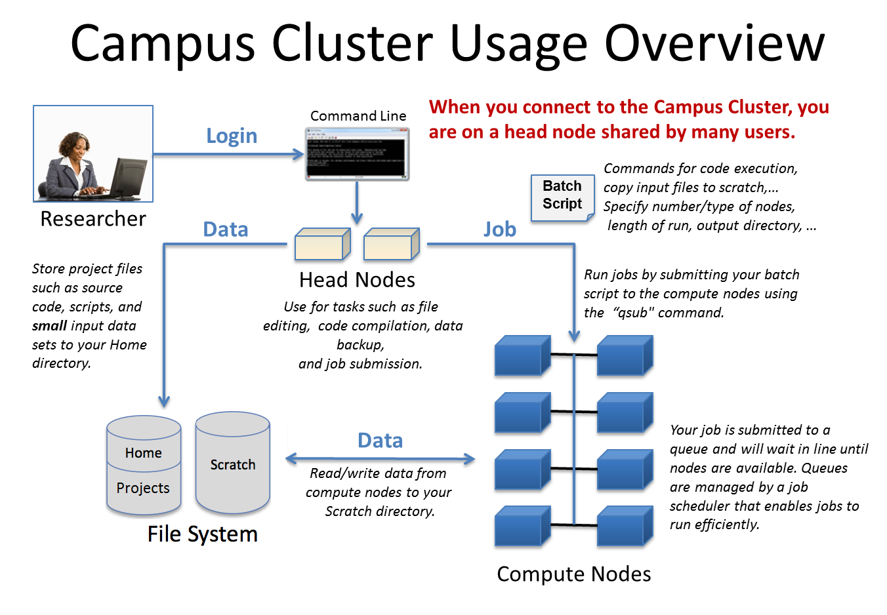

### Delta AI Cluster User Guide

The [Delta AI cluster](https://docs.ncsa.illinois.edu/systems/deltaai/en/latest/index.html) is a shared multi-user GPU cluster. This means that you
are sharing these GPUs with a number of other users from across the country.
To properly facilitate this sharing, Delta AI employs batch scheduling. That
is, you don't get to login into a GPU machine and start using it, but instead
have to submit your job to a queue and wait for it to be scheduled. You
typically start by logging into a login node (or head node), developing your
code, and then using a specialized scripts to submit your jobs.  The scheduler
([Slurm](https://slurm.schedmd.com/documentation.html) on Delta AI) then allocates resources and runs your job on a compute
node. The compute nodes are the ones with the GPUs. Therefore, to successfully
use GPUs on the Delta AI cluster, you need to learn how to use Slurm to submit
your jobs, and to follow best practices that enable multiple users to
successfully make use of these shared resources.

#### Delta AI Cluster Architecture
The Delta AI cluster consists of three types of machines: 4 login nodes, about
150 compute nodes, and some storage nodes.  The login nodes are for you to
develop your code, and conduct light-weight testing, and submit your jobs to
the scheduler.  The compute nodes are where your jobs actually run. And the
storage nodes provide a shared file system across all the login and compute
nodes. Specifically, each compute nodes is equipped with 4 NVIDIA GH200 chips.
See below for a conceptual diagram from the campus cluster, for our intents and
purposes the Delta AI cluster is similarly organized.

   

   
   

#### Getting Started
1. **Logging in into the login node.** You start by logging into a login node via `ssh`.
Best practice is to use `dtai-login.delta.ncsa.illinois.edu` to login (does a round robin allocation to one of the login nodes: `gh-login[01-04].delta.ncsa.illinois.edu`). But you can also use any of the 4 login nodes directly (e.g. `gh-login01.delta.ncsa.illinois.edu`), particularly if you want to use VS code or similar other tools.
   - For Mac/Linux/WSL users:  you can directly use the ssh command, `ssh <your NCSA Delta AI login name>@dtai-login.delta.ncsa.illinois.edu`
   - For Windows users without WSL: Install an SSH-Client (like PuTTY or MobaXterm) and fill in the details:
      - HostName: `gh-login01.delta.ncsa.illinois.edu`
      - Username: `<your NCSA Delta AI login name>`
      - Port: `22`
   - See [Delta AI
website](https://docs.ncsa.illinois.edu/systems/deltaai/en/latest/user-guide/login.html)
for more information about logging in.
   - You may benefit from using a terminal multiplexer like `tmux` or
   `screen` to keep your sessions alive even if your connection drops. You can
   find many tutorials online on how to use these tools.
   - **Important Note:** Do not run your code on the login node. The login
   nodes are shared across all users, and running your code on the login node
   may interfere with other users and can even cause them to crash. Therefore,
   only use the login node to develop your code, and submit your jobs to the
   scheduler.

2. **Data Storage.** Because Delta AI is shared across so many users, it is
important to be careful about where you store your data and how. You can find
all the different options on the [ Delta AI
website](https://docs.ncsa.illinois.edu/systems/deltaai/en/latest/user-guide/data-mgmt.html).
   - Our suggestion would be for you to work from the work directory:
`/work/nvme/bfdu/$USER`. They support large volume I/O (e.g. loading datasets,
or saving models and log files).
   - Specifically, don't use your home directory
(`/u/$USER`) for large volume I/O. Make sure to also back up your code on an
external source (e.g., GitHub, GitLab).
   - Furthermore, make sure to protect your
work from others by restricting the read permissions on your work directories.
This is typically done via the `chmod` command (e.g. via `chmod 700
/work/nvme/bfdu/$USER`). Please read up the documentation for `chmod` to make
sure you properly configure your permissions. If someone copies your work
because you didn't set permissions properly, that will be your responsibility. 

3. **Software.** Because Delta AI is a shared cluster supporting thousands of
users, users don't have permission to install custom software that requires
root access. Instead, many common software packages are already installed on
the cluster. You can start using them by loading the appropriate `modules`,
e.g. via `module load python/3.10.14`. You can also
install software locally in your home directory (e.g. via `pip install --user
<package>`). For the purpose of this programming assignment, we have already
configured a python environment with the necessary dependencies. You can
activate this environment via: `source
/work/nvme/bfdu/cs444/fa25/mp3/venv/bin/activate`, but you will need to load
the modules before it via `module load python/3.10.14 cuda/12.4.0
gcc-native/12.3`.

5. **Submitting your jobs.**
   - Once you have your code ready, you can submit your
  jobs to the scheduler via `sbatch <script>`, where `<script>` is a bash script
  that contains the necessary Slurm directives (e.g. how many GPUs you need, how
  much time you need, etc). We have provided two sample slurm scripts:
  `pixmo.sbatch` and `flower.sbatch` that you can use. Feel free to look at the
  documentation to learn more, but you won't need to mess too much with these
  scripts (except for changing the command you want to run). 
   - When you submit your job, you will get a job ID. You can use this job ID to
  check the status of your job via `squeue -j <jobid>`, or to cancel your job via
  `scancel <jobid>`. When your job completes (or even as it is running), the
  output and error logs will be written to locations you specify, see more
  details in the MP spec and the sbatch files. You may find the following
  commands useful: `tail -f <log file name>`, it continuously watches the log
  file and prints new lines as they are written to the log file. 
   - While your job is running, Delta AI allows you to login into the compute node
  where your job is running. This can be useful for debugging purposes (e.g. to
  check how many resources your job is using, or what the GPU utilization is).
  You can find the name of the compute node where your job is running via `squeue
  -j <jobid>` and login into it from the login node via `ssh <nodename>`. You may
  need to configure ssh keys for doing it, but I am not 100\% sure.
   - Lastly, you also have the option to run your job interactively via `srun -A
  bfdu-dtai-gh --time=00:30:00 --nodes=1  --ntasks-per-node=32 --partition=ghx4
  --gpus=1 --mem=48g --pty /bin/bash`. This will allocate a compute node for you
  and This can be useful for debugging purposes as you can now directly run your
  job on the compute node and quickly fix things that may be causing it to fail.
  Keep in mind that interactive jobs are capped to be short duration, so once you
  finish debuging you should queue your batch job.
   - Because this is a shared environment, your job should only use the amount of
  resources it requests. If you go over, the job typically gets killed.

6. **TensorBoard.** You may want to monitor your training visually using Tensorboard. You can do this by following the following steps:
   - Log in to Delta AI cluster with port forwarding via `ssh -L XXXX:localhost:YYYY <username>@gh-login01.delta.ncsa.illinois.edu` using two 4 digit numbers. 
   - On this same node, load the necessary modules and activate the virtual
   environment as mentioned above. Then launch tesnorboard using `tensorboard
   --logdir=<path to your output directory> --port=YYYY` where YYYY is the same
   as above.
   - On your local machine, open a web browser and go to `localhost:XXXX` where
   XXXX is the same as above. You should be able to see the TensorBoard dashboard.
   - If someone else also logs into the same login node and launches
   TensorBoard on the same port, you will get an error. In that case, just choose
   a different port (e.g. YYYY+1) and try again.
   - (I think) if someone knows the YYYY that you are using, they can also access your
   TensorBoard logs. If you are worried about this, you can use a random high
   port number and terminate your tensorboard process when you are done.
   - XXXX can be same as YYYY, but it doesn't have to be.
   - If you are using VS code, that may also offer you a way to conveniently see tensorboard. 
   Another alternative approach is to copy the logs to your local machine and
   run tensorboard locally. Yet another way is to look at the text logs
   directly using `cat` or `tail -f`.

7. **Copying data to/from Delta AI.** You can use `scp` or `rsync` to copy data
to/from Delta AI.

#### Frequently Asked Questions
1. Where can I find more information about the Delta AI cluster.
    - Please refer the the [Delta AI website](https://docs.ncsa.illinois.edu/systems/deltaai/en/latest/index.html) for the definitive and official information.

We will add FAQs here as we go along.
