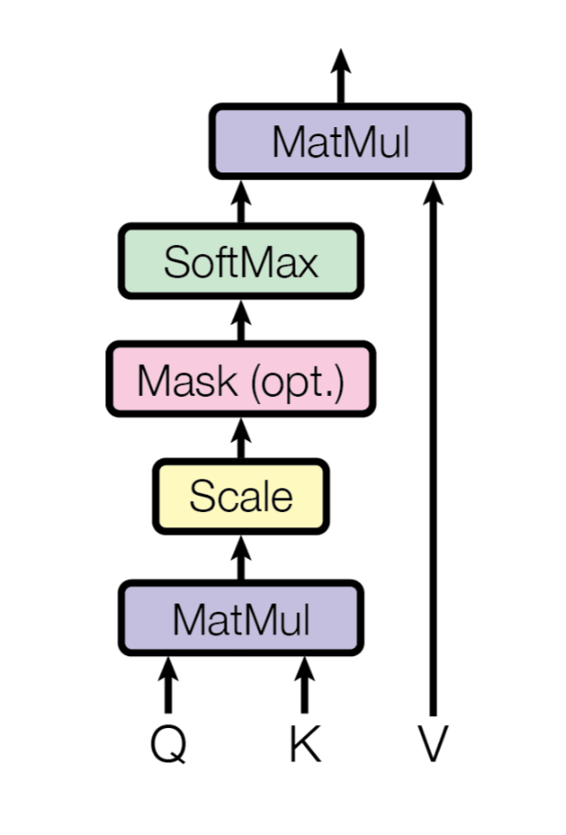
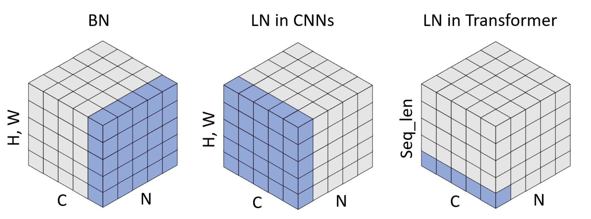
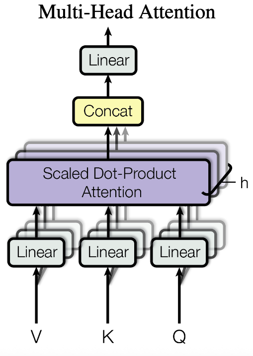
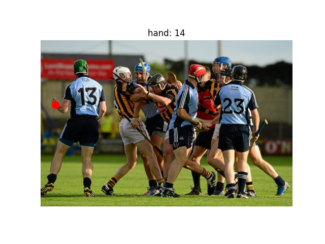
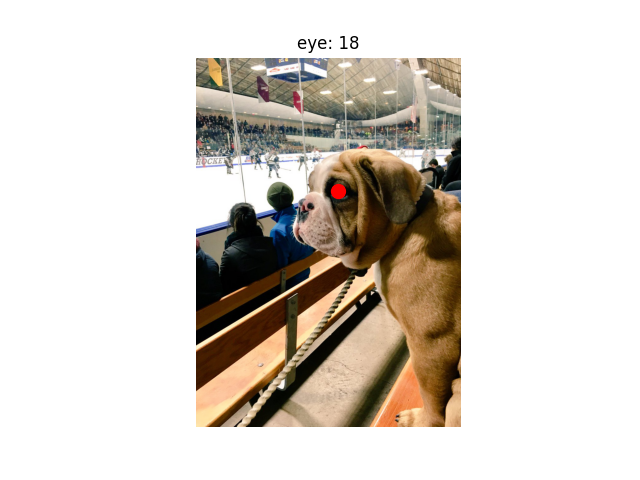
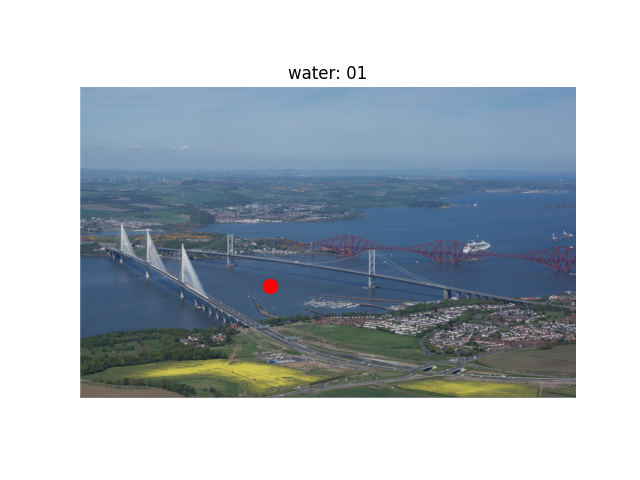
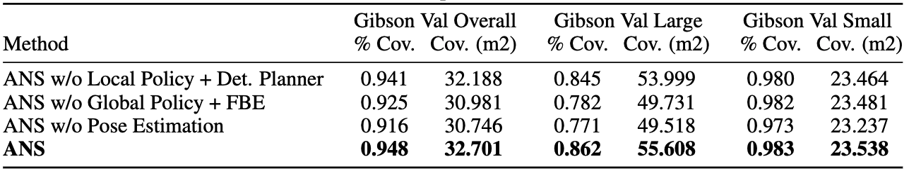

## ECE 494 / CS 444: Deep Learning for Computer Vision, Fall 2025, Assignment 3

### Instructions

1. Assignment is due at **11:59 PM on Thursday Oct 23 2025**.

2. See [policies](https://saurabhg.web.illinois.edu/teaching/cs444/fa2025/policies.html)
   on [class website](https://saurabhg.web.illinois.edu/teaching/cs444/fa2025).

3. Submission instructions:
    1. On gradescope assignment called `MP3-code`, upload the following  files:
        - Your completed `transformer_utils.py`. We will run tests to evaluate
          your pytorch code for `SelfAttention` and`LayerNorm` classes.
        - Predictions from your fine-tuned vision transformer
          (`test_flower.txt`) from Question 2 and predictions from your PixMo model
          (`test_pixmo.txt`) from Question 3. We will benchmark your
          predictions and report back the average accuracy. Score will be based
          on the accuracy of your predictions.
        - Two single self-contained script called `script_q2.py` and
          `script_q3.py` that includes all the code to train and test the model
          that produced the test set results that you uploaded.

       Please also note the following points:
        - Do not compress the files into `.zip` as this will not work.
        - Do not change the provided files names nor the names of the functions
          but rather change the code inside the provided functions and add new
          functions. Also, make sure that the inputs and outputs of the
          provided functions are not changed.
        - The autograder will give you feedback on how well your code did.
        - The autograder is configured with the python libraries: `numpy
          absl-py tqdm torch torchvision` only.
    2. On gradescope assignment called `MP3-report`, upload the following
       - Training / validation plots and a description of what all you
         tried to get the detector to work and supporting control experiments.
         See Question 2.2 and 3.2 for more specific details.

4. Lastly, be careful not to work of a public fork of this repo. Make a private
   clone to work on your assignment. You are responsible for preventing other
   students from copying your work.

5. **CHANGELOG**
    - **2025-10-13**
      * Updated LayerNorm tests (both `test_data/layer_norm.pkl` and autograder) to use biased variance estimate to match PyTorch's LayerNorm implementation.
      * Please use `unbiased=False` when using torch's `var()` function in your implementation.

### Suggested Development Workflow
1. Question 1 can be worked upon locally without a GPU.
2. For Q2, where you have to actually train the model, you will need to use a
   serious GPU to train the model. We have arranged access to GPUs on the Delta AI
   cluster. See instructions [here](./DeltaAI.md):
   - You should follow best practices in using the cluster (mentioned in the
     document), e.g. not run anything on the root node etc. We (and the people
     who run the Delta AI cluster) will be strictly monitoring usage patterns.
     Violating DeltaAI cluster policies may cause you to be banned from using
     it, and we will not be able to provide any help in that situation. So,
     please be careful.
   - Delta AI is a shared resource that we don't control. We aren't able to
     control how long it will take for your jobs to start running. So, start
     ahead of time and budget for the time that your job is queued but not running.
   - You can also explore other training options as well, like
     [Kaggle](https://www.kaggle.com/code) and [Google Colab
     Pro](https://colab.research.google.com/signup). Your personal compute
     device may also have a decent enough GPU, check on that as well.
3. For Q2 and Q3 you will be experimenting with different architectures and
   design choices. This is an iterative process. You implement a few things and
   see how they affect the performance. Based on this feedback, you decde what all
   to try next, and so forth. Therefore, you will need to budget time for your
   trainings to finish, between successive iterations. This is particularly
   more important to be aware of, if you are planning to use the Delta AI
   cluster.

### Setup
#### If you are using the Delta AI cluster
1. We have downloaded the datasets for you. They are at
`/work/nvme/bfdu/cs444/fa25/mp3/data/flower-dataset-reduced/` and
`/work/nvme/bfdu/cs444/fa25/mp3/data/pixmo_data/`. 
2. We also have a python virtual environment with all dependencies
installed at `/work/nvme/bfdu/cs444/fa25/mp3/venv/`. You will need to
`module load python/3.10.14 cuda/12.4.0 gcc-native/12.3` to start using
the python virtual environment. 
3. We also have slurm scripts for you to use, see `flower.sbatch` and
`pixmo.sbatch`.
   
#### If you are not using the Delta AI cluster 
   1. Install pre-requisites in `requirements.txt`
   2. **Download the dataset for Q.2**: Download and unzip the dataset from
   [here](https://saurabhg.web.illinois.edu/teaching/cs444/fa2025/mp3/flower-dataset.zip). 
   If you are on a Unix-based system (macOS or Linux), you can run the
   following commands to download the dataset. If you are using Windows, you
   should manually download the dataset from the link and extract the
   compressed file to the current directory. You should see a
   `flower-dataset-reduced` folder containing the dataset. This dataset is a
   reduced version of the [Oxford 102 Flowers
   Dataset](https://www.robots.ox.ac.uk/~vgg/data/flowers/102/index.html).
   ```bash
   wget https://saurabhg.web.illinois.edu/teaching/cs444/fa2025/mp3/flower-dataset-reduced.zip -O flower-dataset-reduced.zip
   unzip flower-dataset-reduced.zip
   # After this operation you should see a folder called flower-dataset-reduced
   # in the current directory containing three pkl files with the data.
   flower-dataset-reduced
    ├── train_data.pkl     # customed train set
    ├── val_data.pkl       # customed validation set
    └── test_data.pkl      # customed test set
   ```
   
   3. **Download the dataset for Q.3**: Download the dataset from [this
   link](https://drive.google.com/file/d/1tQl6rS40Z2F8M6M_Xhfg-gVF3TBYFZg0/view?usp=sharing).
   Unzip the file and you should see a `pixmo_data` folder containing
   `train_data.pkl`, `val_data.pkl`, and `test_data.pkl`. This dataset is a
   processed version of the [PixMo
   Pointing](https://huggingface.co/datasets/allenai/pixmo-pointing) dataset. 


### Problems
In this programming assignment, we will 
1. implement the attention and layernorm operations using basic pytorch code, 
2. fine-tune a vision transformer for image classification and possibly implement Visual Prompt Tuning
[(VPT)](https://arxiv.org/abs/2203.12119) to obtain the necessary accuracy for
full-credit, and
3. design a transformer model for a classification task on the PixMo dataset. 

The three questions are independent from each other. Specifically, the code you
write for Q1 does not get used for Q2 or Q3.


1. **Implement Self Attention and Layer Norm and Multi-head Attention Time Complexity**

   In this part, you will learn implement `SelfAttention` and `LayerNorm`
   layers. These layers from the bulding blocks for transformer models.
   Complete the `SelfAttention` and `LayerNorm` classes in
   [transformer_utils.py](./transformer_utils.py). 

   1.1 [2 pts Autograded] We will implement the attention operation from the
   transformer paper ["Attention Is All You Need", Vaswani et al.,
   2017](https://arxiv.org/abs/1706.03762). The calculation of scaled
   dot-product attention is illustrated in the figure below:
   $$\text{Attention}(Q, K, V)=\text{softmax}\left(\frac{Q K^T}{\sqrt{d_k}}\right) V$$
   where $Q$ is the query matrix, $K$ is the key matrix, $V$ is the value
   matrix, and $d_k$ is the dimension of the key matrix.
   
   <div align="center">
   
   </div>

   Finish the implementation of self attention by following the instruction in
   the [SelfAttention](./transformer_utils.py#L5) class. You can test your
   `SelfAttention` implementation by running the following command. The test
   takes the input embeddings of shape `(batch_size, seq_len, hidden_dim)` as
   input, generate attention outputs of shape `(batch_size, seq_len,
   hidden_dim)`.

   ```bash
   python -m unittest test_functions.TestClass.test_self_attention -v 
   ```

   1.2 [2 pts Autograded] Layer normalization transforms the inputs to have
   zero mean and unit variance across the features. In this question, you will
   apply Layer Normalization over a mini-batch of inputs as described in the
   paper [Layer Normalization](https://arxiv.org/abs/1607.06450). The figure
   below shows the concept of Layer Norm (LN) in Transformer, which only
   calculates statistics in the channel dimension without involving the batch
   sequence length dimension, which is different from LayerNorm as used in a
   CNN layer.
   (Image credit: [Leveraging Batch Normalization for Vision Transformers](https://openaccess.thecvf.com/content/ICCV2021W/NeurArch/html/Yao_Leveraging_Batch_Normalization_for_Vision_Transformers_ICCVW_2021_paper.html)).

   <div align="center">
   
   </div>
   
   For a batch of input embeddings $X \in \mathbb{R}^{B \times T \times C}$
   (where $B$ is the batch size, $T$ is the length of the sequence, $C$ is the
   number of channels (hidden dimension)), learnable scales and shift
   parameters $w \in \mathbb{R}^C$ and $b \in \mathbb{R}^C$. Layer
   Normalization (LN) normalizes the input X as follows: $$\mathrm{LN}(X)=w
   \frac{X-{\mathbb{E}_C}[X]}{\sqrt{\text{Var}_C[X]+\epsilon}}+b$$
   
   You can test your `LayerNorm` implementation by running the following command. The test takes the 
   input embeddings of shape `(batch_size, seq_len, hidden_dim)` as input, generate normalized outputs of shape `(batch_size, seq_len, hidden_dim)`.

   ```bash
   python -m unittest test_functions.TestClass.test_layer_norm -v 
   ```

   1.3 [1 pts Manually Graded] **Time complexity of multi-head self-attention block**: In a transformer, the self-attention block is applied several times in multiple layers and multiple heads. A multi-head attention block is shown in the figure below. Consider a multi-head attention block with key (K), query (Q) and value (V), each of dimension `T x D` where `T` is the number of tokens and `D` is the embedding dimension. These are first processed through Linear layers (with weight matrix `D x D`) and then split along the embedding dimension into `H` heads, each of dimension `T x (D/H)`. Each head is processed through a self-attention block and the outputs are concatenated and passed through another Linear layer to get the final output, also of dimension `T x D`. Calculate the time complexity, in Big O notation, of this multi-head attention block in terms of `T`, `D` and `H`. You can assume that `D` is divisible by `H` and `H << D`. Explain your answer in the report.

   <div align="center">
   
   
2. [4pts Autograded, 2pts Manually Graded] **Transfer Learning with Transformer**
   The starter code implements a linear classifier on top of a vision
   transformer. You can run this using the following command. Use the
   `--exp_name` flag to select the hyperparameters set in `config.yml` (You can
   change these when finetuning). The training loop also does validation once in
   a while and also logs train / val loss and accuracy to tensorboard. This
   script saves the predictions on the test set in a file called
   `test_flower.txt` inside `runs_flower/vit_linear/`.
   
   ```bash
   python demo_flower.py --exp_name vit_linear --output_dir runs_flower/vit_linear/
   ```
   To run this job on the Delta AI cluster, you will need to submit a job. You
   can do this using the [flower.sbatch](./flower.sbatch) and by running the
   following command:

   ```bash
   sbatch --export=ALL,OUTPUT_DIR="runs_flower/vit_linear/",EXP_NAME="vit_linear" --output="runs_flower/vit_linear/%j.out" --error="runs_flower/vit_linear/%j.err" flower.sbatch
   ```
   This queues the job that eventually gets run. You can monitor the status of
   the job using `squeue -u $USER` and different log files are stored in the
   folder `runs_flower/vit_linear/`. The terminal output will be visible in the
   `.out`, `.err`, and `.txt` files in that folder. We have created a python
   virtual environment and have already downloaded the dataset for you to use
   on the DeltaAI cluster.  Submitting jobs using the sbatch file above already
   uses these.
   
   Since you will be performing multiple training runs, you will benefit from
   storing the outcome of different runs in different directories. You can
   change the values of `OUTPUT_DIR`, `output` and `error` in the command above
   to specify the output directories for the different runs.  Refer to DeltaAI
   cluster instructions mentioned under **Suggested Development Workflow** for
   more details about other best practices for using a GPU cluster.

   Just doing this gives good performance already. Your goal is to improve the
   performance of this model by investigating alternate strategies for
   finetuning a vision transformer. **You are welcome to try any strategy as long
   as you: a) stick to the data (and augmentations) that we provide, and b)
   stick to the pre-trained `vit_b_32` that we provide.** We experimented with
   finetuning the full ViT backbone and shallow and deep versions of Visual
   Prompt Tuning (described below). We found Deep version of VPT to work the
   best and meet the accuracy threshold.  
   - [vision_transformer.py](./vision_transformer.py) describes the vision
     transformer architecture. You will work with `vit_b_32`.
   - [fine_tune.py](./fine_tune.py) describes the training loop and how we set
     up the linear layer on top of the ViT encoder. You are welcome to use as
     much or as little of this code.
    
   **Visual Prompt Tuning (VPT)**. The [Visual Prompt Tuning
   paper](https://arxiv.org/abs/2203.12119) introduces VPT as an efficient and
   effective alternative to full fine-tuning for large-scale Transformer models
   in vision. VPT introduces only a small amount of trainable parameters in the
   input space while keeping the model backbone frozen. You can experiment with
   VPT. We recommend to implement the VPT-Deep method introducted in the
   Section 3.2 in this paper, where prompts are introduced at every Transformer
   layer's input space. 

   The raw ViT with $N$ layers is formulated as:
   $[\mathbf{c}_i, \mathbf{X}_i] =L_i ([\mathbf{c}_{i-1}, \mathbf{X}_{i-1}])$. 
   Classification is done via: $\mathbf{y} =\text{Head}\left(\mathbf{c}_N\right)$ 
   where $\mathbf{c}_i \in \mathbb{R}^d$ denotes [CLS]'s embedding and 
   $\mathbf{X}_i$ denotes the set of features for the different tokens in the
   image as output by the $i^{th}$ layer $L_{i}$.

   Now with VPT-Deep, for $(i+1)$-th Layer $L_{i+1}$, we denote the collection
   of input learnable prompts as $\mathbf{P}_i=\left\{\mathbf{p}_i^k \in
   \mathbb{R}^d \mid k \in \mathbb{N}, 1 \leq k \leq m\right\}$ and concatenate
   the prompts with the embeddings on the sequence length dimension. The
   deep-prompted ViT is formulated as:
   $${\left[\mathbf{c}_i, \ldots, \mathbf{X}_i\right] } =L_i ([\mathbf{c}_{i-1}, \mathbf{X}_{i-1} \mathbf{P}_{i-1}]),$$

   $$\mathbf{y} =\text{Head}\left(\mathbf{c}_N\right)$$

   $\mathbf{P}_i$'s are learnable parameters that are trained via back-propagation. 


   **Implementation Hints**: If you decide to implement deep Visual Prompt
   Tuning, here are some implementation notes that may be useful. You could
   create a new class in `finetune.py` that stores the ViT backbone and the
   learnable prompts via `nn.Parameter(torch.zeros(1, num_layers, prompt_len,
   hidden_dim))`. The `hidden_dim` of the prompt is the same as the
   `hidden_dim` of the transformer encoder, and they are both `768` in our
   implementation. The forward function passes these prompts along with the
   input $x$ to the ViT encoder. You will also need to modify the ViT encoder
   to accomodate prompts at each layer. Thus, you may also need to modify the
   the `forward` function of the `Encoder` class in the `vision_transformer.py`
   file.
   
   **Suggested Hyperparameters**: We found the following hyper-parameters to
   work well: 10 prompts per layer, prompts were initialized using weights
   sampled uniformly from $[-v, v]$ where $v^2 = 6/(\text{hidden dim} +
   \text{prompt dim})$, `SGD` optimizer with a learning rate of `0.01`, weight
   decay of `0.01`, training for `100` epochs with learning rate being dropped
   by a factor of 10 at epoch 60 and 80. The hyperparameters that are set 
   in the code right now will not give good performance.
   
   You can evaluate this development on the validation set. For the validation
   run with the best performance, upload the predictions on the test set to
   gradescope.

   **2.1** Upload the `test_flower.txt` file to Gradescope
   to obtain its performance on the test set. It will be scored based on the
   accuracy it obtains. This is the autograded part. Submissions with an
   accuracy of **`0.92`** or higher will receive full credit.

   **2.2** For the manually graded part:
     - Include snapshots for the training and validation plots for loss and accuracy from tensorboard for your best run.
     - Document the hyperparameters and/or improvement techniques you applied
       in your report and discuss your findings. **Include control
       experiments** that measure the effectiveness of each aspect that lead to
       large improvements.  It is insightful to do backward ablations: starting
       with your final model, remove each modification you made one at a time
       to measure its contribution to the final performance. You must present
       your results in tabular form along with a discussion of the results, see
       Q3.2 for an example Ablations Table.

3. [4pts Autograded, 2pts Manually Graded] **Model Design on PixMo Dataset**
   
   In this question, you will design and train a model the
   [PixMo dataset](https://arxiv.org/abs/2409.17146) for a classification task.
   The task is to classify the class for the object indicated by a 2D point on
   the image. See some example images below (the 2D point is shown via a red
   dot).
   
   <div align="center">
   
   
   
   </div>
   
   There are a total of 20 classes (labels 0-19). The images may be of
   different sizes. We have also provided a dataset class `PixmoPointsDataset`
   in `custom_dataset.py` to help you load the data. It returns the image, the
   2D point, and the corresponding label. 
   
   The starter code implements a simple classifier on top of a ResNet backbone
   followed by a multi-head, multi-layer transformer encoder layer (PixMo Model
   in `model.py`). You can run this using the following command. Use the
   `--exp_name` flag to select the hyperparameters set in `config.yml` (You can
   change these when finetuning). The training loop also does validation once
   in a while and also logs train / val loss and accuracy to tensorboard. This
   script saves the predictions on the test set in a file called
   `test_pixmo.txt` inside the output directory (`runs_pixmo/pixmo_demo` in the
   command below).
   
   ```bash
   python demo_pixmo.py --exp_name pixmo_demo --output_dir runs_pixmo/pixmo_demo
   ```
   Like for Q2, we have a sbatch script that you can use to run this training
   on the Delta AI cluster. 
   ```bash
   sbatch --export=ALL,OUTPUT_DIR="runs_pixmo/pixmo_demo/",EXP_NAME="pixmo_demo" --output="runs_pixmo/pixmo_demo/%j.out" --error="runs_pixmo/pixmo_demo/%j.err" pixmo.sbatch
   ```

   This command took around 30 min to run on a RTX 3090 GPU. This model gives
   an accuracy of 0.18 on the validation set. 

   **Implementation Hints**

   This is an open-ended design problem and your goal is to improve the
   performance of this model by investigating different strategies for model
   design, training, and optimization. **Do not change the ResNet backbone (you
   are free to finetune the backbone)**. You are welcome to try any strategy
   including but not limited to:
   - Using crops around the point as input in addition to the entire image.
   - Exploring positional embeddings for the transformer encoder (e.g. fixed or learnable)
   - Tuning hyperparameters of transformer, optimizer, learning rate, scheduler

   **Suggested Hyperparameters**

   Based on the model implementation, here are some hyperparameter combinations to try:

   ```python
   # Basic transformer configuration
   num_heads = 2
   num_layers = 2
   patch_tokens = 1
   in_features = 512 # same for query_dim, key_dim, value_dim, ff_dim
   dropout = 0.1
   
   # Training hyperparameters
   learning_rate = 3e-4
   batch_size = 16
   num_epochs = 20
   ```

   You can experiment with (feel free to modify other hyperparameters as well):
   - Different patch tokens (1, 2, 4, 8) to vary spatial resolution of image / crop features (You may need to modify the input features to the classifier head accordingly)
   - Different numbers of self-attention heads & layers in transformer (1, 2, 4)
   - Learning rate (1e-3, 3e-4, 1e-4), dropout (0.0, 0.1, 0.2)

   **3.1** Upload the `test_pixmo.txt` file to Gradescope to obtain its performance on the test set. It will be scored based on the accuracy it obtains. This is the autograded part. Submissions with an accuracy of **`0.45`** or higher will receive full credit.

   **3.2** For the manually graded part:
   - Include snapshots for the training and validation plots for loss and
     accuracy from tensorboard for your best run.
   - Document the model design choices, hyperparameters, and/or improvement
     techniques you applied in your report and discuss your findings. **Include
     control experiments** that measure the effectiveness of each aspect that
     lead to large improvements. For example, if you are trying to improve the
     performance of your model by trying different model architectures or
     training strategies, you should include a control experiment that measures
     the performance of the model using different approaches. It is insightful
     to do backward ablations: starting with your final model,  remove each
     modification you made one at a time to measure its contribution to  the
     final performance. You must present your results in tabular form along
     with a discussion of the results. Here is an example ablation table format
     from a [ICLR paper](https://arxiv.org/pdf/2004.05155) with each variant
     tried in each row and the corresponding metrics in each column.
   <div align="center">
   
   </div>
